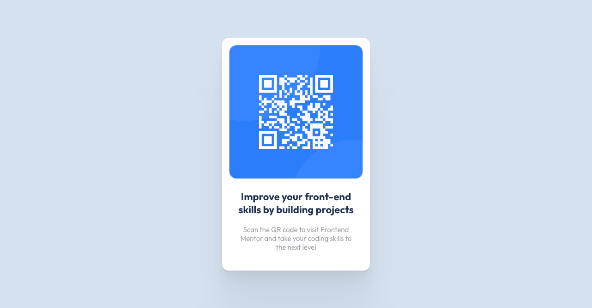

# Frontend Mentor - QR code component solution

This is a solution to the [QR code component challenge on Frontend Mentor](https://www.frontendmentor.io/challenges/qr-code-component-iux_sIO_H). Frontend Mentor challenges help you improve your coding skills by building realistic projects.

## Table of contents

- [Overview](#overview)
  - [Screenshot](#screenshot)
  - [Links](#links)
- [My process](#my-process)
  - [Built with](#built-with)
  - [What I learned](#what-i-learned)
  - [Continued development](#continued-development)
  - [Useful resources](#useful-resources)
- [Author](#author)
- [Acknowledgments](#acknowledgments)

## Overview

### Screenshot

<i>screenshot for desktop</i>

 

<i>screenshot for mobile</i>

### Links

- Solution URL: [github](https://github.com/Phenics13/frontendmentor-io-qr-code-component)
- Live Site URL: [netlify](https://bucolic-gumdrop-cff5a1.netlify.app/)

## My process

### Built with

- Mobile-first workflow
- [React](https://reactjs.org/) - JS library
- [Styled Components](https://styled-components.com/) - For styles

### What I learned

I practiced my basic skills in React and Styled Components.

### Continued development

I am going to focus on using TypeScript in the next challenges. Also I will complete some of them using Next.js in the future.

### Useful resources

- [Smooth Shadow](https://shadows.brumm.af/) - This helped me creating nice box-shadow in CSS.

## Author

- Website - [phenics13.github.io](https://phenics13.github.io/)
- LinkedIn - [Sergei Dranchenko](https://www.linkedin.com/in/sergei-dranchenko-93b800262/)
- Frontend Mentor - [@Phenics13](https://www.frontendmentor.io/profile/Phenics13)
- GitHub - [Phenics13](https://github.com/Phenics13)

## Acknowledgments

Thanks [Web Dev Cody](https://www.youtube.com/@WebDevCody) for sharing [Frontend Mentor site](https://www.frontendmentor.io/).
